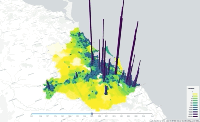

# brisbane_development_map
3D Map of Brisbane's population and infrastructure development from 1961.

For this to work, you will need to source a data file with historical and future populations in a hexgrid.

The columns should have the form: pop_total_yy

The data should be in a geojson in the data directory: pop_hexagons_4326.geojson.



## Gettings Started:

```
pipenv shell
python server.py
```